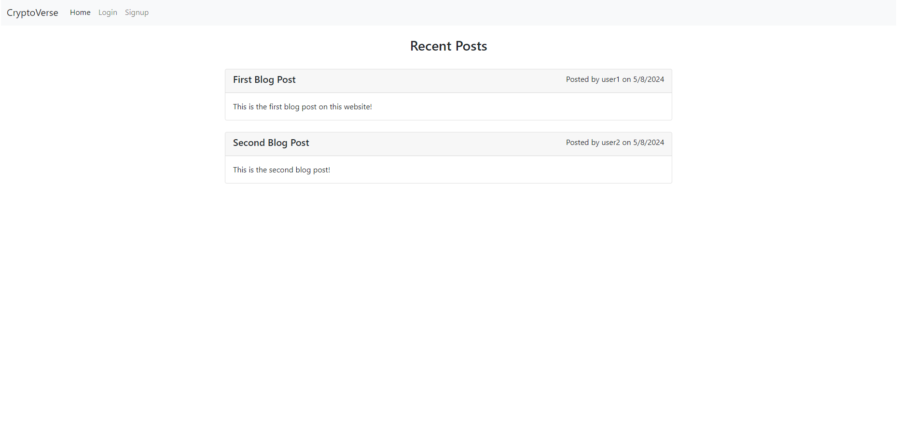

# cryptoverse-blog

The best crypto blog in existence!



## Table of Contents

- [Description](#description)
- [Usage](#usage)
- [Technologies](#technologies)
- [Questions](#questions)
- [Liscence](#liscence)

## Description

Cryptoverse-Blog is a meticulously designed blog template that embraces the Model-View-Controller (MVC) architectural pattern to provide a streamlined and efficient web development experience. This template incorporates a robust and responsive Bootstrap framework, ensuring that the user interface is visually appealing and adaptable to different devices and screen sizes. The backend is powered by Express, a flexible Node.js web application framework, which efficiently handles requests and delivers dynamic content using Express Handlebars. Handlebars simplifies the task of generating HTML markup, allowing developers to create reusable templates and maintain a clean separation between the presentation layer and the underlying data model. The integration of these technologies makes Cryptoverse-Blog an ideal solution for developers looking to build professional, maintainable, and scalable blogs with ease. 

## Usage

### Prerequisites

> **_NOTE:_**
> This package assumes you already have Node.js and npm installed. If you don't, [download Node.js](https://nodejs.org/en/download) first then come back to these installation steps.

### Live Production:

A live deployment of the application can be found [here](https://cryptoverse-blog-5710e4b7a1ef.herokuapp.com/home).

### Local Development:

1. Open your terminal and clone the github repo:

```
git clone https://github.com/hokage-216/cryptoverse-blog.git
```

2. 'cd' into the folder:

```
cd cryptoverse-blog
```

3. Then run this command to install the required packages:

```
npm install
```

## Usage

After installing required packages, you are able to run:

```
npm start
```

The program will begin allowing you to answer each prompt accordingly.

## Technologies

- **Frontend**: HTML5, JavaScript, Express Handlebars, Bootstrap 5
- **Backend**: Node.js, Express.js, Sequelize, Mysql2, BCrypt, Express Session Cookies, Express Session Sequelize, Connect Session Sequelize, Dotenv, Nodemon
- **Version Control**: Git and GitHub

## Questions

If you have any questions about the repo, open an issue or contact me directly at berrylevente@hotmail.com.

To view more of my work [click here](https://github.com/hokage-216/).

## Liscence

Licensed under the MIT license. To view the license terms [click here](https://opensource.org/licenses/MIT).